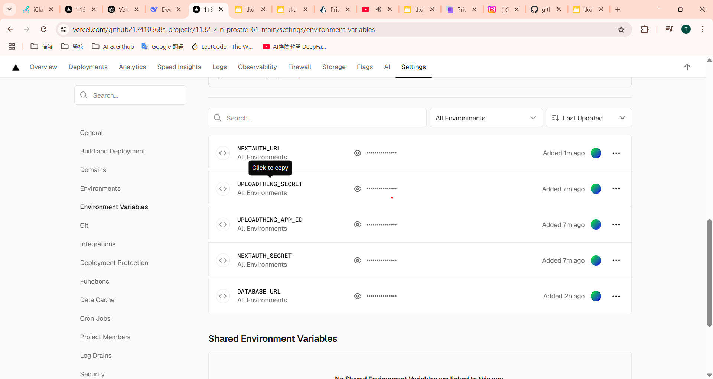

# 113-2 Web 程式設計 期末 project 說明

#### 重點說明

助教在期末考後有跟老師提到，有很多同學們在期末考時，都堅持做到很晚才離開，加上老師了解能跟課到最後的同學，基本上都有認真在學習，因此老師興起了將期末考同學有可能未完成的部分，延續到期末 project 繼續做的想法，一方面可以幫同學加一點分數，另一方面也可以鞏固大家對 prostore demo 實作上有進一步的理解，對未來進一步開發 fullstack 應用程式會有幫助。

本期末 project，要求同學們必須要放入 Vercel 中執行，資料庫可以選用 Prisma Postgres，或是老師後來測試的 Supabase (下面有文字說明)。

本作業繳交，老師模擬了期末考試出題的方式，其中老師有在環境設定，及要求同學提供可以測試的使用者資料上，要求給予圖片或文字說明，請同學務必配合，以方便老師或助教測試。

本作業同期末考，千萬不要作弊，請同學們千萬不要將 code 傳給其他同學，以免造成抄襲，而造成本次期末 project 0 分，另扣平常分數 20 分，得不償失。

如果有程式上的問題，可以問老師或助教，以協助同學們解決。

本作業繳交時間，6 月 17 日星期二晚上 23:59 前，要繳交 md_project.pdf 檔，及 期末 project code 之壓縮檔

原來在 6 月 18 日 E201 機房驗收的部分，改成需要時動態驗收。同學們不需要到 E201 機房驗收。

老師有需要釐清問題時，會通知同學，用 MSTeams 進行動態驗收，需要時會要求同學們，直接將電腦執行畫面分享給老師或助教做驗收。

期末報告分兩部分，占比 100%，自主學習加分 20%，要點如下：

Part 1: 上課 prostore_xx 及期末考 cabins_xx: (70%)

- P1 (10%): 環境設定
- P2 (10%): User role CRUD (Profiles)
- P4 (20%): Admin role CRUD (Products)
- P3 (30%): 期末考 /cabins_xx, show cabin details (new)

Part 2: 自主學習實作含加分 (30%~50%)

- P5 (15%): Case 1, CRUD
- P6 (15%): Case 2, CRUD
- 其他加分 (20%)

P5, P6 兩題是自主學習 CRUD 部分，本來規定是要重新建構，不要和 prostore 混在一起，但如果同學們在實作上出現了困難，就直接做在 prostore 之 admin 選單上。

同學們也可以選擇從大一上至大二下，上課有 demo 過的範例來進行，如 blog, menu, product 等範例，可以如 cabins 範例一樣，有前端的顯示畫面，也有 admin 端的 CRUD。前端顯示時，css 可以用 styled components 封裝起來，我們在之前的期中考題中有展示過。

如果同學們在實作上，已經進行，做的較深入者，請詳細說明，老師會看實際狀況給予額外 20% 加分。

---

#### 期末 project 甘苦談

請告知老師你在 prostore 跟課實作，與期末 project 實作之甘苦談，有什麼建議，及其他想說的話，都可以寫在這裡。

---

Part 1: 上課 prostore_xx 及期末考 cabins_xx: 60%

- P1 (10%) 環境設定
- P2 (10%): User role CRUD (Profiles)
- P4 (20%): Admin role CRUD (Products)
- P3 (30%): 期末考 /cabins_xx, show cabin details (new)

Paert 2: 自主學習實作 (30%)

- P4 (15%): Case 1, CRUD
- P5 (15%): Case 2, CRUD

##### 自評總分: 80 分

---

#### (10%) P1: 提供期末 project 之 Github URL, Vercel, 及 .env 資訊

##### => 上課 prostore_xx 之 Github & Vercel URL，點選時可以連出去

[Github-1 URL](https://github.com/github212410368/1132_2N_prostre_61-main.git)
[Vercel-1 URL](https://1132-2-n-prostre-61-main.vercel.app/)


##### => 如果期末 project，你是放在不同的 Github & Vercel URL，請提供新的 Github, Vercel URL

[Github-2 URL](https://github.com/github212410368/1132_2N_prostre_61-main.git)
[Vercel-2 URL](https://1132-2-n-prostre-61-main.vercel.app/)

請提供 Github-2, Vercel-2 URL 圖片


##### => 請檢查，如果期末 Github repo 還沒分享給老師及助較，請分享

老師：htchung@gms.tku.edu.tw
助教：sian-0018

以下圖片，顯示老師分享給助教


##### => .env 資訊

密碼可以遮掉，老師目前是連接到 Supabase，主要原因是期末考需要連到 local PostgreSQL，必須選擇標準的 connection string 連接方式，而 Prisma Postgres 沒有支援直接 PostgreSQL 直接連線。

同學們可以延續用上課教的 Prisma Postgres，如果有想用 Supabase 連接，可以參考老師期末考的 code，在產生 prisma client 那一段，不要使用 Prisma Postgres 的 accelerate 功能，如下 code 所顯示，註解掉的是因為要連接 Supabase 而註解掉，如果使用 Prisma Postgres，就不需要註解掉。

```
// import { withAccelerate } from '@prisma/extension-accelerate';
import { PrismaClient } from '@/lib/generated/prisma';
import sampleData from './sample-data';

// const prisma = new PrismaClient().$extends(withAccelerate());
const prisma = new PrismaClient();

async function main() {
  await prisma.product.deleteMany();
  await prisma.user.deleteMany();
  await prisma.product.createMany({
    data: sampleData.products,
  });
  await prisma.user.createMany({
    data: sampleData.users,
    // skipDuplicates: true,
  });

  console.log('Database seeded successfully');
}

main()
  .then(async () => await prisma.$disconnect())
  .catch(async (error) => {
    console.log(error);
    await prisma.$disconnect();
    process.exit(1);
  });

```

如果要連結 Supabase，要同時在 npm build 時要移除 --no-engine 的設定。

記得要放上 Vercel 前，一定要在 local 端執行 npm run build，要能成功 build, Vercel build 才會成功。

```
# package.json
  "scripts": {
    "dev": "next dev",
    "build": "prisma generate && next build",
    "start": "next start",
    "lint": "next lint",
    "postinstall": "prisma generate "
  },
```


#### => schema.prisma 設定

以下是連接到 Supabase 的設定，其中有兩個環境變數

DATABASE_URL: 通常會透過 connection pool 方式支援多個連線需求，Prisma Postgres 及 Supabase 都需要這個設定

DIRECT_URL: 支援可以直接連入 Supabase PostgreSQL，Prisma Postgres 不需要這一個環境變數

如果你使用了 Supabase，請記得使用你的 Supabase 環境來做設定。

請提供你的 .env 設定，讓老師知道你是使用 Prisma Postgres 還是使用 Supabase。

```
# .env

# For Supabase
DIRECT_URL="postgresql://postgres.iakgducdloaetfyuvkmv:[db password]@aws-0-us-west-1.pooler.supabase.com:5432/postgres"

DATABASE_URL="postgresql://postgres.iakgducdloaetfyuvkmv:[db password]@aws-0-us-west-1.pooler.supabase.com:6543/postgres?pgbouncer=true&connection_limit=1"
```

如果是使用 Prisma Postgres，只需要 DATABASE_URL 環境變數，因此需要移除 directUrl = env("DIRECT_URL") 這一行

請提供你的 schema.prisma db 設定，讓老師知道你是使用 Prisma Postgres 還是使用 Supabase

```
# schema.prisma
generator client {
  provider = "prisma-client-js"
  output   = "../lib/generated/prisma"
}

datasource db {
  provider  = "postgresql"
  url       = env("DATABASE_URL")
  directUrl = env("DIRECT_URL")
}
```

#### => Vercel: Build and Deployment 設定


#### => Vercel: Environment Variables 設定

其中的 NEXTAUTH_URL, NEXTAUTH_URL_INTERNAL 這兩個環境變數，要修改，指到 Vercel URL，而不是 localhost:3000


##### => Vercel dashboard 顯示 deployment Ready，表示 deployment 成功


#### Your Answer

#### (10%) P1: 提供期末 project 之 Github URL, Vercel, 及 .env 資訊

##### => 上課 prostore_xx 之 Github & Vercel URL

[Github-1 URL]()
[Vercel-1 URL]()


##### => 如果期末 project，你是放在不同的 Github & Vercel URL，請提供 Github, Vercel URL

[Github-2 URL]()
[Vercel-2 URL]()

請提供 Github-2, Vercel-2 URL 圖片


##### => 請檢查，如果期末 Github repo 還沒分享給老師及助較，請分享

老師：htchung@gms.tku.edu.tw
助教：sian-0018

以下圖片，顯示老師分享給助教


##### => .env 資訊


#### => schema.prisma 設定

以下是連接到 Supabase 的設定，其中有兩個環境變數

DATABASE_URL: 通常會透過 connection pool 方式支援多個連線需求，Prisma Postgres 及 Supabase 都需要這個設定

DIRECT_URL: 支援可以直接連入 Supabase PostgreSQL，Prisma Postgres 不需要這一個環境變數

如果你使用了 Supabase，請記得使用你的 Supabase 環境來做設定。

請提供你的 .env 設定，讓老師知道你是使用 Prisma Postgres 還是使用 Supabase。

```
# .env

# For Supabase
DIRECT_URL="postgresql://postgres.iakgducdloaetfyuvkmv:[db password]@aws-0-us-west-1.pooler.supabase.com:5432/postgres"

DATABASE_URL="postgresql://postgres.iakgducdloaetfyuvkmv:[db password]@aws-0-us-west-1.pooler.supabase.com:6543/postgres?pgbouncer=true&connection_limit=1"
```

如果是使用 Prisma Postgres，只需要 DATABASE_URL 環境變數，因此需要移除 directUrl = env("DIRECT_URL") 這一行

請提供你的 schema.prisma db 設定，讓老師知道你是使用 Prisma Postgres 還是使用 Supabase

```
# schema.prisma
generator client {
  provider = "prisma-client-js"
  output   = "../lib/generated/prisma"
}

datasource db {
  provider  = "postgresql"
  url       = env("DATABASE_URL")
  directUrl = env("DIRECT_URL")
}
```

#### => Vercel: Build and Deployment 設定


#### => Vercel: Environment Variables 設定

其中的 NEXTAUTH_URL, NEXTAUTH_URL_INTERNAL 這兩個環境變數，要修改，指到 Vercel URL，而不是 localhost:3000



##### => Vercel dashboard 顯示 deployment Ready，表示 deployment 成功


---

#### (10%) P2: Prostore_xx User 相關功能

##### => 顯示目前 User model 有多少 users，可使用 npx prisma studio 來說明


##### => 請以某個 user role 的使用者登入，並執行選單中的 profile，並將 name 改成 User-htc, 其中 htc 是你的名字代號


##### => 從 prisma studio 檢視是否 name 已經改變


#### Your Answer

##### => 顯示目前 User model 有多少 users，可使用 npx prisma studio 來說明


##### => 請以某個 user role 的使用者登入，並執行選單中的 profile，並將 name 改成 User-htc, 其中 htc 是你的名字代號


##### => 從 prisma studio 檢視是否 name 已經改變


---

以上 P1, P2 題目，老師有給圖，需要提供老師及助教足夠資訊，以便能進行實際批改測試。

P3, P4 題目，老師只給 CRUD 第一張總圖，之後老師不再給圖，除非有需要，請自行截圖，並標示答案。

---

#### (20%) P3: 以 admin 角色登入，進入 Admin 選單 Products

#### Your Answer

##### => (Read) 點選 Admin 選單上的 Products，要能顯示所有 products


##### => (Create) 隨上題，點選 Create Products 可以進行新增，包含圖片新增


##### => (Update) 隨上題，點選 Edit 可以進行修改，包含新增圖片或 banner


##### => (Delete) 隨上題，點選 Delete 可以刪除某項產品


---

#### (30%) P4: 以 admin 角色登入，進入 Admin 選單 Cabins

#### Your Answer

##### => 可以透過 /cabins_xx 顯示所有的 cabins


##### => 點選某個 cabin 之 details & reservation 按鈕，可以進一步顯示該 cabin 詳細資訊


##### => (Read) 點選 Admin 選單上的 Cabins


##### => (Create) 隨上題，點選 Create Cabins 可以進行新增


##### => (Update) 隨上題，點選 Edit 可以進行修改，包含新增圖片或 banner


##### => (Delete) 隨上題，點選 Delete 可以刪除某項產品


---

#### (15%~25%) P5: 自主學習 Case 1

#### Your Answer

##### => 請說明自主學習 Case 1 的內容 及 CRUD

請以文字及圖片說明之

##### => 自主學習加分部分 (+10%)

如有自主學習，超過上課的內容，請自行分段說明之

##### => 可以透過設定的路由，顯示 Case 1 的前端畫面


##### => (Read) 點選 Admin 選單上 Case 1, 顯示 CRUD 整體畫面


##### => (Create) 隨上題，可以進行新增


##### => (Update) 隨上題，可以進行修改


##### => (Delete) 隨上題，可以進行刪除


---

#### (15%~25%) P6: 自主學習 Case 2

#### Your Answer

##### => 請說明自主學習 Case 2 的內容 及 CRUD

請以文字及圖片說明之

##### => 自主學習加分部分 (+10%)

如有自主學習，超過上課的內容，請自行分段說明之

##### => 可以透過設定的路由，顯示 Case 2 的前端畫面


##### => (Read) 點選 Admin 選單上 Case 2, 顯示 CRUD 整體畫面


##### => (Create) 隨上題，可以進行新增


##### => (Update) 隨上題，可以進行修改


##### => (Delete) 隨上題，可以進行刪除


